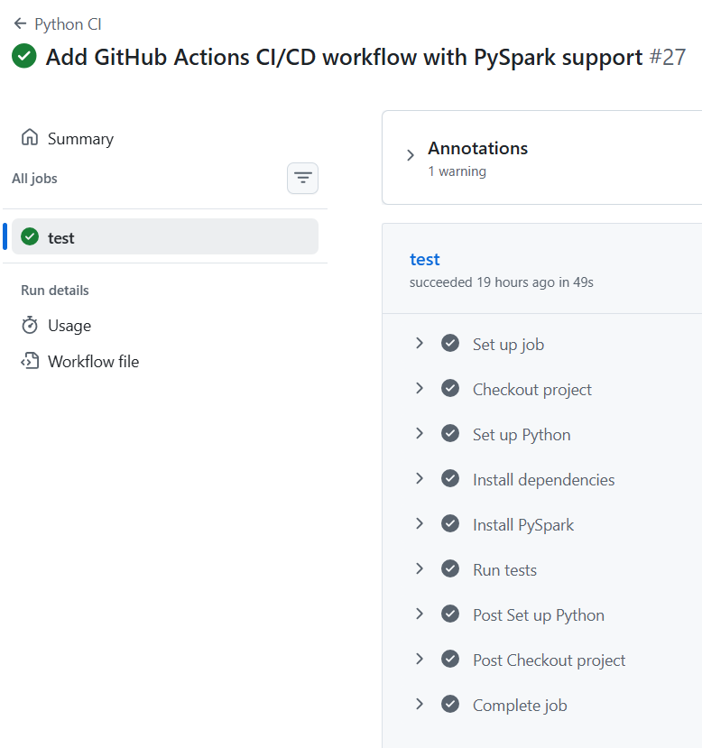
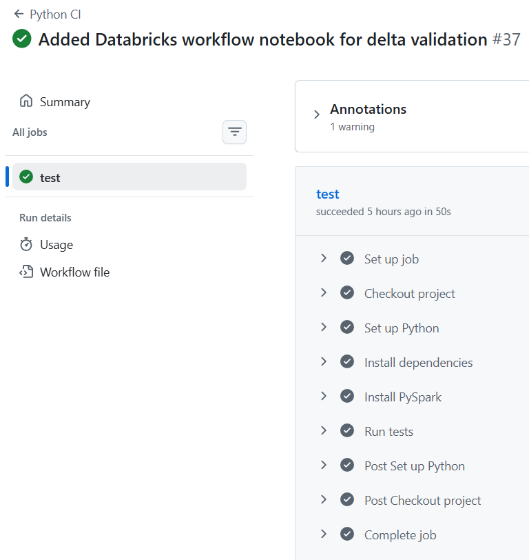
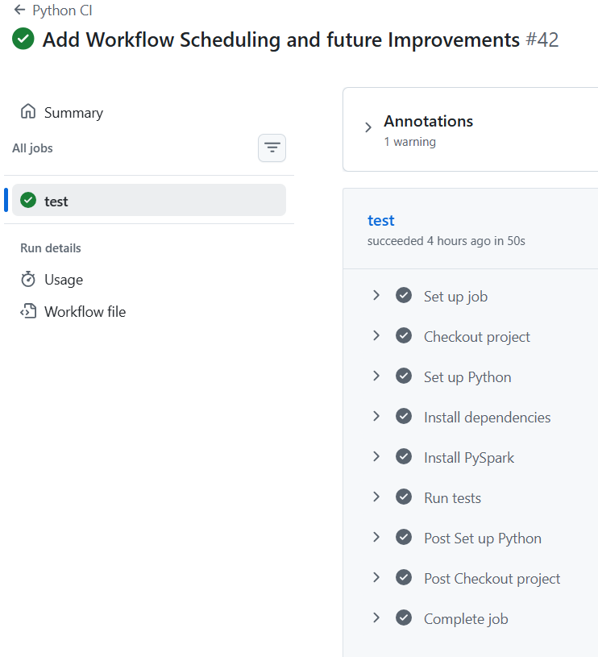
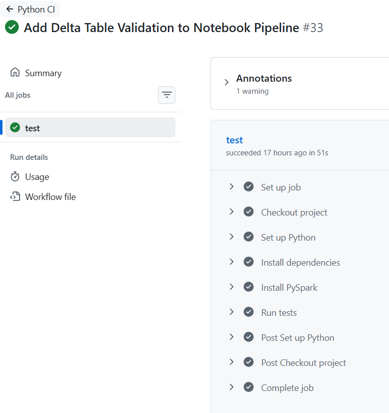

# Databricks CI/CD Retail Sales Project

## Project Overview
This project demonstrates an end-to-end Data Engineering pipeline using Databricks, PySpark, Delta Lake, GitHub, and CI/CD concepts.

The pipeline follows the Medallion Architecture:

Bronze → Silver → Gold

## Architecture Explanation

This project follows the Medallion Architecture pattern in Databricks.

### Bronze Layer
The Bronze layer stores raw retail sales CSV data exactly as ingested from the source system.

Tasks:
- Read CSV data
- Store raw data
- Preserve original records

### Silver Layer
The Silver layer performs data cleaning and transformation.

Tasks:
- Convert data types
- Remove invalid records
- Calculate Revenue column
- Prepare data for analytics

Example:
Revenue = Quantity × Price

### Gold Layer
The Gold layer creates business-ready aggregated data.

Tasks:
- Group sales by category
- Calculate total revenue
- Generate reporting datasets

### Workflow Automation

Databricks Workflows automatically run the notebook every day at 6:00 AM.

Features:
- Automated scheduling
- Delta table validation
- Failure email notifications
- Production-style orchestration

### CI/CD Process
This project uses GitHub and GitHub Actions for CI/CD.

Process:
1. Create feature branch
2. Develop changes
3. Commit & Push
4. Create Pull Request
5. Run automated tests
6. Merge into main branch

### Technologies Used
- Databricks
- PySpark
- Delta Lake
- Unity Catalog
- GitHub
- GitHub Actions
- Databricks Workflows
- pytest

## Technologies Used
- Databricks
- PySpark
- Delta Lake
- Unity Catalog
- GitHub
- GitHub Actions
- pytest
- Databricks Workflows

## CI/CD Workflow

1. Create feature branch
2. Make code changes
3. Commit and push
4. Create pull request
5. GitHub Actions runs tests
6. Merge into main

## Databricks Workflow
The Databricks job runs the notebook automatically.

Features:
- scheduled daily run
- Delta table validation
- failure email notification

## Data Quality Tests
This project includes automated tests for:
- revenue calculation
- null checks
- duplicate checks
- data type checks
- negative value checks

## Workflow Scheduling

This project includes automated Databricks workflow scheduling.

Features:
- Daily scheduled pipeline execution
- Automated Delta table validation
- Workflow failure notifications
- GitHub CI/CD integration

The workflow processes retail sales data through:
Bronze → Silver → Gold architecture.

## Architecture Diagram

CSV File

 ↓

Bronze Layer

   ↓

Silver Laye

   ↓

Gold Layer

   ↓

Delta Validation

   ↓

Databricks Workflow

   ↓

GitHub Actions CI/CD

## Architecture

This project follows a Medallion Architecture approach using Bronze, Silver, and Gold layers.

### Bronze Layer
- Raw retail sales CSV data is ingested into Databricks.
- Data is stored without transformation.

### Silver Layer
- Data cleaning and type casting are performed.
- Revenue column is calculated using Quantity × Price.

### Gold Layer
- Aggregated business metrics are generated.
- Total revenue is summarized by product category.

### CI/CD Pipeline
- GitHub Actions automatically runs validation tests on pull requests.
- Databricks Workflows execute notebook jobs using Serverless compute.
- Automated scheduling is configured for daily execution.

## Screenshots

### GitHub Actions CI/CD Success

### Databricks Workflow Success

### Delta Table Validation

## Resume Summary
Built an end-to-end Databricks Medallion Architecture pipeline with PySpark, Delta Lake, Unity Catalog, GitHub Actions CI/CD, automated testing, workflow scheduling, and failure notifications.
